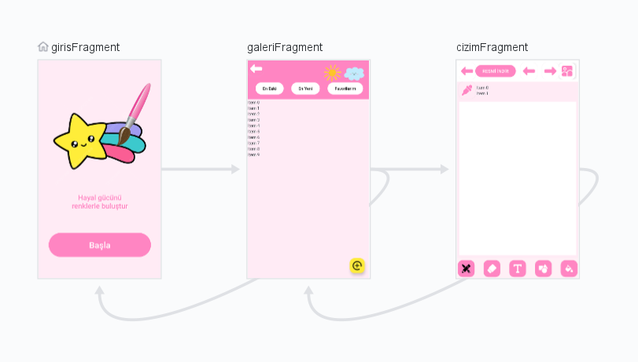
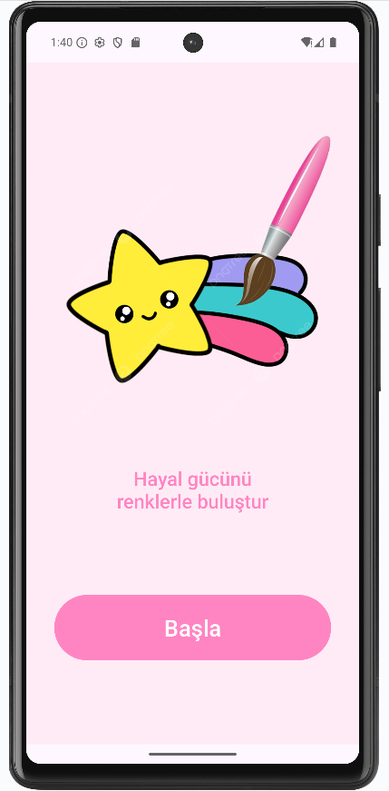
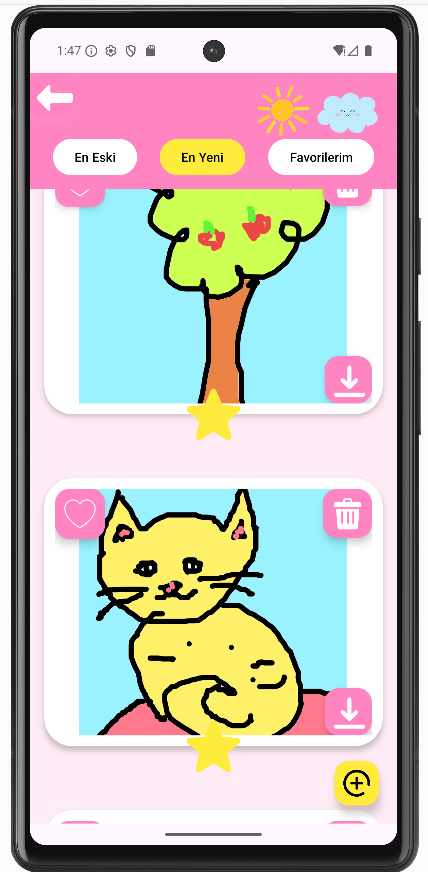
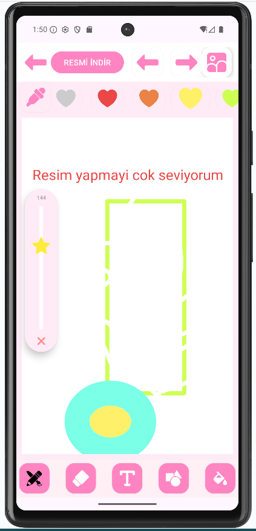
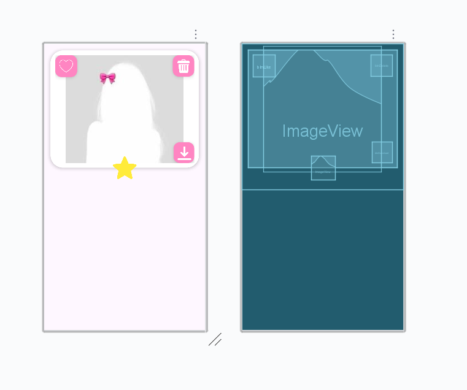

# PDK4 Grup Kotlin Projesi
Bu proje, **Programlama Dillerinin Kavramları** dersi kapsamında **Kotlin** kullanılarak geliştirilmiş bir resim çizebilmeyi sağlayan **Android mobil uygulamasıdır**. Eğitim amaçlı hazırlanmış olup temel Android bileşenlerini ve kullanıcı arayüzü tasarımını içermektedir.

---
## Proje Geliştiricileri
* Şerife Nazlı Ünay
* Firdevs Tosun
* İrem Çelik
---

## Proje Amacı

* Kotlin ile Android uygulama geliştirme pratiği kazanmak
* Android Studio ortamını ve activity yapısını öğrenmek
* Kullanıcı arayüzü (UI) tasarımı konusunda deneyim kazanmak

---

## Kullanılan Teknolojiler

* Kotlin
* Android Studio
* XML
* Android SDK

---

## Arayüz Görselleri
### Navigasyon

### Ana Ekran

### Galeri

### Çizim Ekrani

### Kart

> Görseller `Arayuzler/` klasörü altında yer almaktadır.

